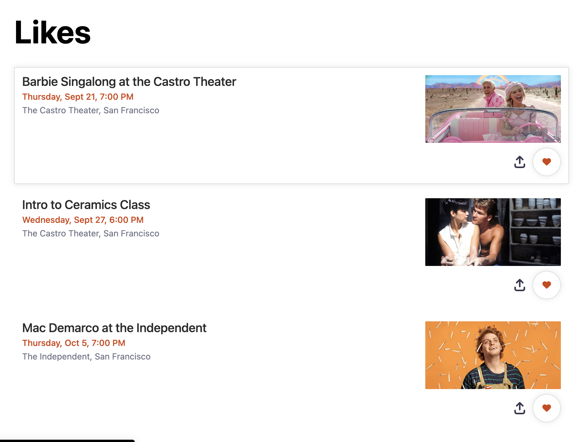
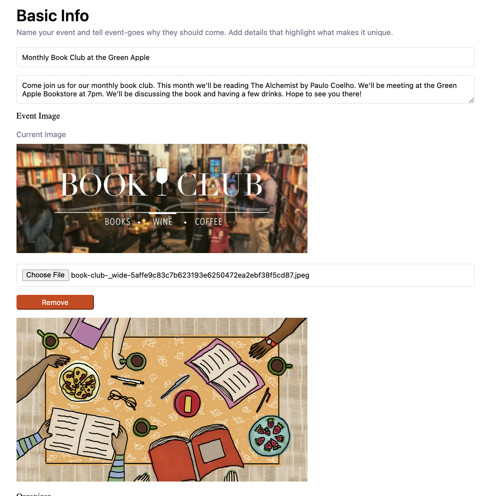

Live website: [EventOrange]()

EventOrange is clone of the popular event finder website [Eventbrite](https://www.eventbrite.com/). EventOrange allows users to sign up, find events in their area, likes events, and buy tickets.

# Technologies Used
- JavaScript
- React
- Redux
- Ruby on Rails
- AWS (image hosting)
- PostgreSQL
- HTML
- CSS

# Features

EventOrange uses a React/Redux front-end to manage page state in a single page application and allows user interaction without constantly linking to new pages. Redux is used to manage global state. The back-end runs on Ruby on Rails with API controllers to provide CRUD actions for user creation, auth, events, tickets, and likes.

## User Authentication
- Users can create an account with EventOrange
- Users can log in and log out
- Buying tickets, creating events, and liking events require user login

## Events
- One of the core events of EventOrange
- Users can create events, edit events, and remove events
- Events on displayed on user index for users to find as well as show pages
for more details

## Tickets
- Users can buy tickets to events
- Users can remove tickets for their events
- Users can view all of their tickets in a user tickets page

## Likes
- Users can like and unlike events
- Users can view all of their liked events in a user liked events page

# Highlighted Features
## Like Button
EventOrange provides a like button for users to like and unlike events. The button is it's own component that is rendered in several places across the site. When an event is liked, the heart will be filled in and otherwise it will be gray. When you consider which page you're on and whether a user is logged in or not, it becomes a bit of a challenge to make sure the likes are being applied correctly.

In the event index page, you have several events that may not be liked by the user and can be viewed without a user being logged in. Meanwhile in the liked events page, all of the events are liked so by default it should be filled in. Below is an example of the events index page with likes being applied for the user and the Liked Events page.

## Event Editing and AWS Image Hosting
After users create events, they can also edit their events. Events require events images which are processed by the backend and stored in an AWS bucket using Rails Active Storage. The edit event functionality for images turned out really well. We provide a preview of the current image of your event. Then you can choose a new image with a preview as well. Users have the option to remove the new image if they like select a different one. Once users click on update event, the backend handles replacing the image. All in all I'm proud of how fluid and convenient I made updating the image for events.

# Features to add in the future
- I would like to add category search, date search, and location search
- Tickets don't currently have prices for events so I would like to add that as well
- I'd like to add more modals in general
  - ticket checkout
  - editing ticket while on the user tickets page
  - notifying users about required login before redirecting
- Better error handling on forms
- Add notifications when you edit events, tickets, or likes
- Add google maps to show events on a map view instead of just index view
